# Arduino 跟隨照明自走車 - Report

**2020 Embedded System Final Project**

**107062228 陳劭愷**

[https://github.com/justin0u0/arduino-auto-follow-car](https://github.com/justin0u0/arduino-auto-follow-car)

最終完成圖（側邊）

最終完成圖（正面）

# Goal

---

實作一台跟隨照明自走車，功能包括：

1. 當物體直線遠離車體時，自走車需要跟上物體的移動。
2. 當物體過於靠近車體時，自走車需要後退。
3. 當物體移動到車體右前方時，自走車需要右轉。
4. 當物體移動到車體左前方時，自走車需要左轉。
5. 在不同的亮度環境下提供不同強度的光線照明（光線越暗、照明越強）
6. 在剛啟動時，自動旋轉以找尋物體跟隨。
7. 如果超過 10 秒沒有偵測到範圍內有物體，則進入休眠模式。透過 Button Interrupt 的方式將其喚醒。

# Components

---

## L298n 馬達驅動模組

L298n 上提供了一些 Pin 來方便的對兩顆馬達 Motor A、Motor B 進行操作。

L298n 示意圖
Image source: [https://components101.com/modules/l293n-motor-driver-module](https://components101.com/modules/l293n-motor-driver-module)

下表介紹如何透過 L298n 控制 Motor A、Motor B：

[L298n Pin 腳](https://www.notion.so/a73393c7819547ec85069ae755ddbbbf)

接下來介紹如何使用 IN1、IN2、ENA 控制 Motor A 的轉速、轉向：

[IN1, IN2, ENA 控制 Motor A](https://www.notion.so/d18ebe2962ef444292ffeeffbf03adc0)

而事實上，ENA 是可以透過電壓大小來控制 MotorA 轉速，也就是 ENA 的電壓越高，則 Motor A 轉速越高。因此可以透過 PWM 的方式控制電壓大小來控制馬達轉速。

IN3、IN4、ENB 控制 Motor B 的方式與 IN1、IN2、ENA 控制 Motor A 的方式相同，就不再多介紹。

## HC-SR04 超聲波模組

超聲波可以幫助偵測前方物體的距離，使用的是 HC-SR04 模組。

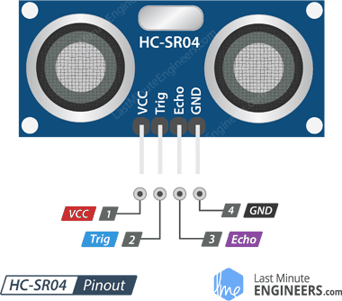

超聲波模組示意圖
Image source: [https://lastminuteengineers.com/arduino-sr04-ultrasonic-sensor-tutorial/](https://lastminuteengineers.com/arduino-sr04-ultrasonic-sensor-tutorial/)

[HC-SR04 Pin 腳](https://www.notion.so/a0f4e4c585b4473cba1631ac38449506)

**距離計算方式如下：**

若設超聲波聲音速度 $340\ m/s=0.034\ cm/ms$，再乘以超聲波來回時間的一半即可得到距離。

因此距離 $時間\times0.5\times0.034\approx 時間/58\ (cm)$。

## 紅外線避障模組

在此 Project 中紅外線模組用於感應左前方、右前方有沒有物體存在，來判別應該要往哪一個方向轉向。

紅外線避障模組示意圖
Image source: [https://www.taiwansensor.com.tw/product/紅外線避障模組-避障-近接開關-感應距離可調/](https://www.taiwansensor.com.tw/product/%E7%B4%85%E5%A4%96%E7%B7%9A%E9%81%BF%E9%9A%9C%E6%A8%A1%E7%B5%84-%E9%81%BF%E9%9A%9C-%E8%BF%91%E6%8E%A5%E9%96%8B%E9%97%9C-%E6%84%9F%E6%87%89%E8%B7%9D%E9%9B%A2%E5%8F%AF%E8%AA%BF/)

[紅外線避障模組 Pin 腳](https://www.notion.so/93f6b06929de4067a65c4bee920c3083)

紅外線模組上的旋鈕可以調整檢測距離，順時針轉可以增加檢測距離。

## LED

在此 Project 中使用 LED 於照明功能。並使用 PWM 來控制 LED 亮度。

## Photo Resistor 光敏電阻

在此 Project 中使用光敏電阻來接收照明亮度，以此控制 LED 亮度大小。

# Implementation

---

## Wiring

[Arduino 與模組的接線](https://www.notion.so/49653feba97049dbb7ee4e8d0e2ff1e7)

L298n 的供電使用 9V 鹼性電池供電，因為若使用 Arduino 的 5V 來供電，雖然 L298n 上的指示燈可以正常運作，但是馬達沒有足夠的力度轉動。

Arduino 板則是使用行動電源供電，因為車體用 USB 連接著電腦就無法四處移動。

## Code

這次 Project 採用 OOP 的方式來撰寫 Code，因此由上而下，先介紹各個 Class 的用途，再介紹三個 FreeRTOS 的 Task，最後是一些 ISR、功能函數、和 Arduino 的 Setup、Loop。

### 變數宣告

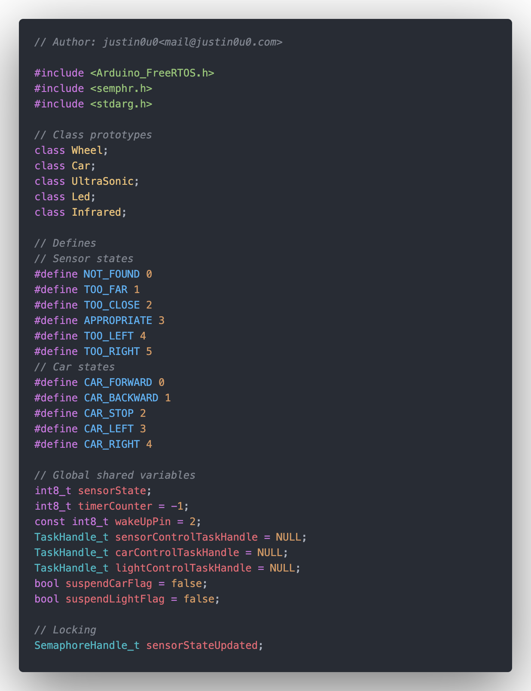

在此我們宣告了的 Class 的 Prototype，定義了一些 state、全域共享變數以及 Locking 用的變數。

### Class Wheel

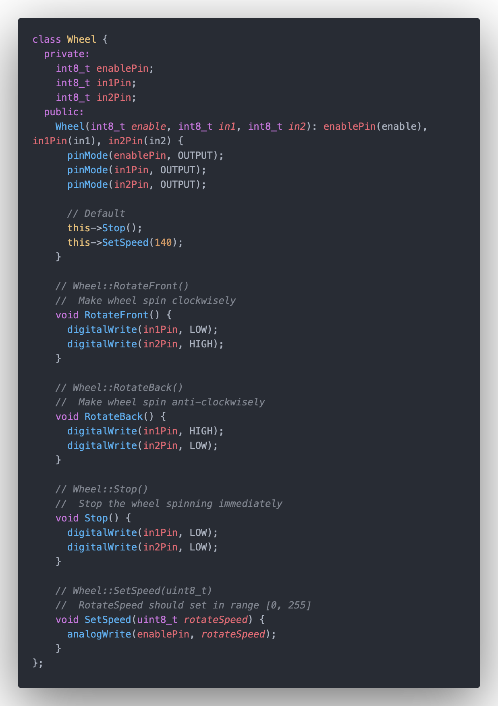

`Wheel` 控制 Motor 的轉動方向以及轉速，初始化時我們帶入兩個 IN 和一個 Enable 的 Pin 腳

位，預設 Motor 為停止狀態以及轉速 140，並提供以下函數：

- `Wheel::RotateFront` → 輪子往前轉動。
- `Wheel::RotateBack` → 輪子往後轉動。
- `Wheel::Stop` → 輪子快速停止。
- `Wheel::SetSpeed` → 使用 PWM (`analogWrite`) 控制 Enable Pin 的輸出電壓，因此速度的範圍是在 0 ~ 255 之間，用來控制輪子的轉速。

### Class Car

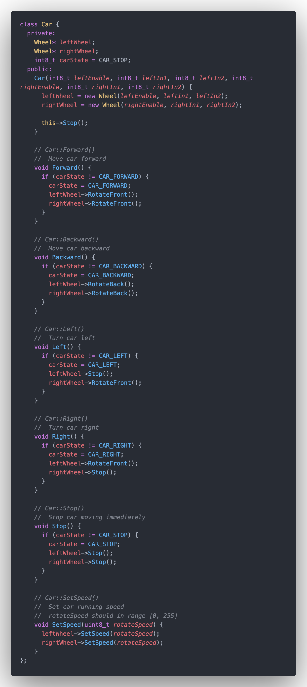

`Car` 控制車體的運行，因此可以知道一個車體必須有兩個 `Wheel`，初始化時，帶入兩個輪子的兩個 IN 以及一個 Enable 的腳位，將兩個 `Wheel` 進行初始化。提供以下函數方便車體運行的操作：

- `Car::Forward` → 前進即是兩個輪子都前進。
- `Car::Backward` → 後退即是兩個輪子都後退。
- `Car::Left` → 向左轉即右輪前進左輪不動。
- `Car::Right` → 向右轉及左輪前進右輪不動。
- `Car::Stop` → 停止即兩個輪子快速停止。
- `Car::SetSpeed` → 設定車速即設定兩輪轉速。

對於上述的前 5 個函數，為了避免連續呼叫兩次相同函數而還要再次多呼叫函數，使用一個私有變數 `carState` 來記錄上一次被呼叫的是哪一個函數，並只有在呼叫了與 `carState` 不同的狀態時才執行函數。

### Class UltraSonic

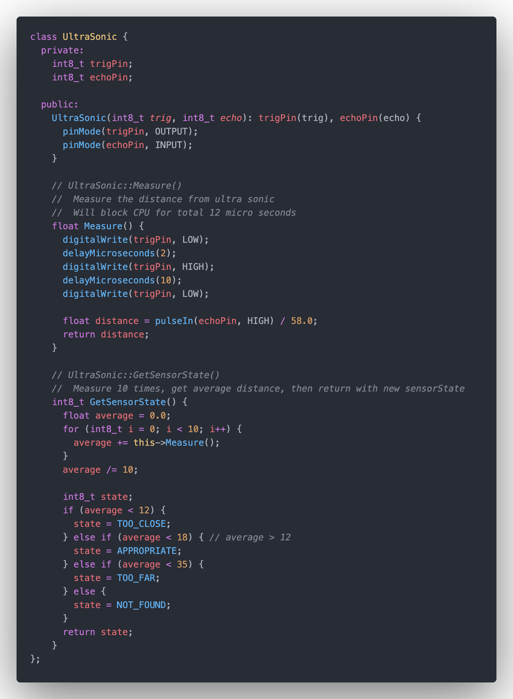

`UltraSonic` 控制超聲波的運作，在初始化時傳入 Trig、Echo 的腳位。提供兩個函數方便操作：

- `UltraSonic::Measure` → 進行一次超聲波量測並回傳結果。

    在前面有介紹到，要開始量測需要對 Trig Pin 輸出 ≥ 10ms 的連續高電壓，因此先將 `trigPin` 設成 `LOW`，經過 2ms 後即輸出 10ms 的高電壓，利用 `pulseIn` 函數得到 `echoPin` 上連續高電壓的時間，計算出距離(cm)並回傳。

- `UltraSonic::GetSensorState` → 多次計算距離後取平均並回傳四種結果：太近 `TOO_CLOSE`、適中 `APPROPRIATE`、太遠 `TOO_FAR` 以及找不到物體 `NOT_FOUND`。

    因為超聲波的量測會有誤差，因此我採用量測 10 次取平均值的方式，平均後再回傳結果。

### Class Led

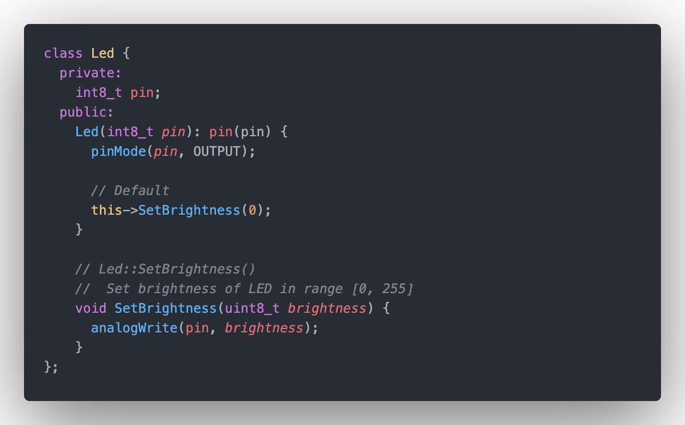

`**Led**` 控制 LED 亮度，在初始化時傳入 LED 腳位。提供一個函數方便操作：

- `Led::SetBrightness` → 設定 LED 亮度，使用的是 `analogWrite` 來做到 PWM，因此亮度的範圍在 0 ~ 255 之間。

### Class Infrared

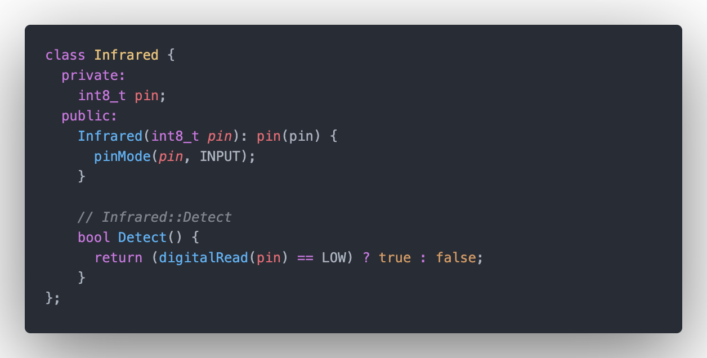

`Infrared` 控制紅外線，在初始化時傳入紅外線腳位。提供一個函數方便操作：

- `Infrared::Detect` → 偵測紅外線是否有偵測到物體。

### Task sensorControlTask

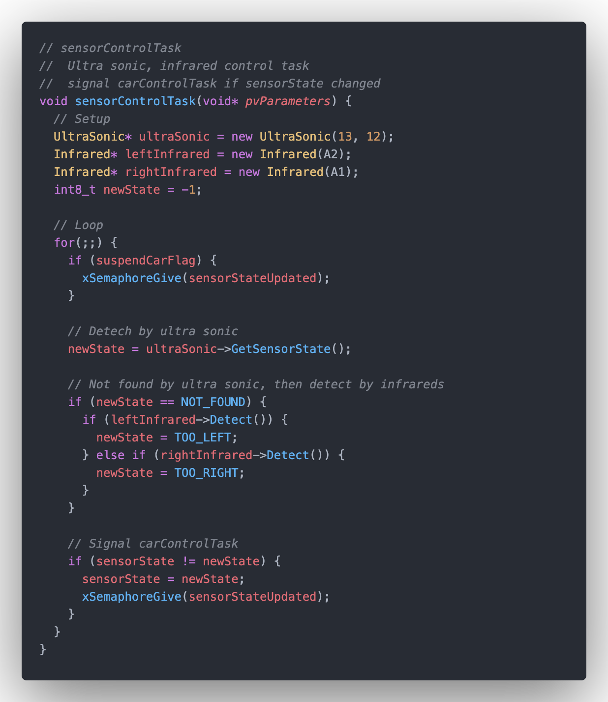

在 `sensorControlTask` 中，首先偵測超聲波前是否有物體，使用 `UltraSonic::GetSensorState` 來取得新的 state。若超聲波並沒有找到任何物體，則物體可能是移動到車體的左前或是右前方，因此對兩個紅外線都進行偵測，如果有偵測到的話則知道新的狀態可能是物體在左前側 `TOO_LEFT` 或是在右前側 `TOO_RIGHT`。最後取得的新狀態 `newState` 若與上一個狀態 `sensorState` 不同，則告知讓 `carControlTask` 運行。

因為 `carControlTask` 中會等待 `sensorStateUpdated` 這個 binary semaphore 有資源時才執行，因此決定何時讓 `carControlTask` 運行是 `sensorControlTask` 的重要工作。可以看到只有兩個情況下要讓 `carControlTask` 運行，一是當 `sensorState` 被改變，因此車子的行為也應該要改變；二是在 `suspendCarFlag` 為 `true` 時，這個 flag 是用來告知要進入休眠模式的，詳細會在後面介紹。

### Task lightControlTask

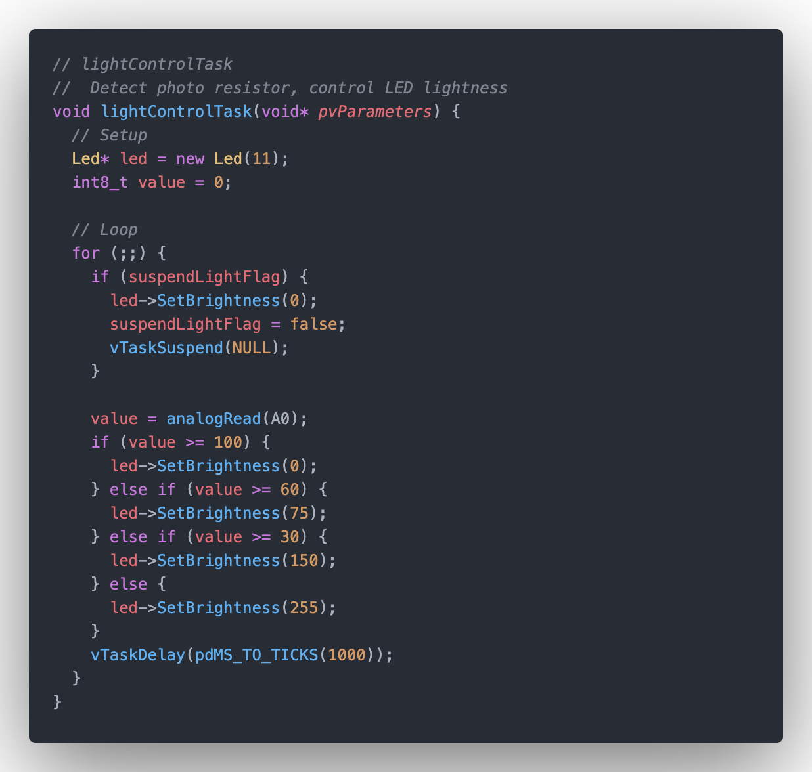

在 `lightControlTask` 中，要偵測光敏電阻的亮度，並且設定 LED 的亮度。

`suspendLightFlag` 為要進入休眠模式時會被設成 `true`，當進入休眠模式時，將 LED 全數關閉並將自己這個 task 暫時 suspend。

### Task carControlTask

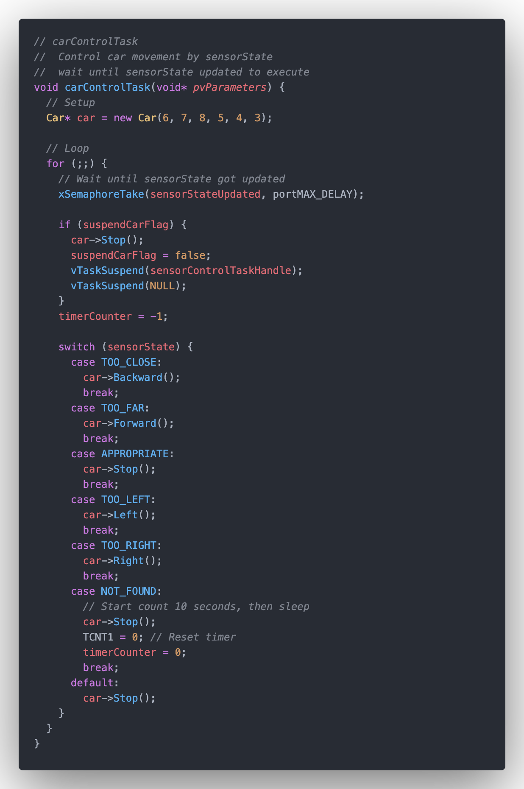

在 `carControlTask` 中，上面有提到，必須等待 `sensorControlTask` 告知偵測物體狀態有所改變時，才進行操作，因此使用 `xSemaphoreTake` 來等待 `sensorStateUpdated` 這個 signal。

接著就可以利用全域共享變數 `sensorState` 來得知現在物體與車體的狀態是如何的。根據每一種不同的狀態，即可對車子進行操作。例如：太靠近 `TOO_CLOSE` 的話可以 `Car::Backward` 來後退。這裡就不多贅述。

當物體沒有被偵測超過 10 秒應該要進入休眠模式，因此在 `NOT_FOUND` 時，將 Timer1 的計數器 Reset，並且將 `timerCount` 從 -1 變成 0。`timerCount` 在 -1 時代表不需要計時，所以平時 `timerCount` 應該要是 -1，這部分會在底下再說明。

當 `suspendCarFlag` 被設起，代表應該要進入休眠模式，因此將車子進入停止狀態，同時 suspend `sensorControlTask` 以及自己 `carControlTask`。

### Interrupt Timer1

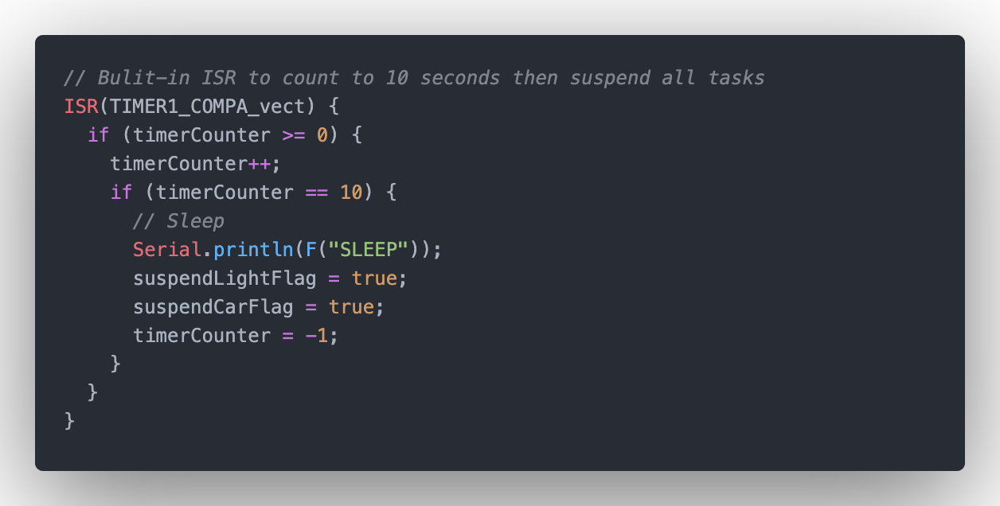

本次 project 中使用 Timer1 來計時 10 秒沒有偵測到物體後進入休眠模式。因為 Timer1 的 prescaler 最大到 1024 而已，而 Arduino 的時脈為 16M，並且 Timer1 使用的 register 為 16 bits 的：

$2^{16}\div(1.6\times10^6)\approx4.16(s)$

可以知道就算用上最大的 prescaler，一次的 Timer1 Overflow 都還是無法計算到 10 秒的，因此使用了 `timerCounter` 來計算 10 次的一秒取代，並且將一次的 Timer1 Interrupt 時間設為 1 秒。

上面有提到當 `timerCounter == -1` 時代表不計時，因此當 `timerCounter ≥ 0` 時將 `timerCounter` 加一，當加到 10 的時候，代表經過了 10 秒了，因此將 `suspendLightFlag` 以及 `suspendCarFlag` 都設成 `true`。

### Interrupt wakeUp

`wakeUp` 函數用來當做按鈕的 Interrupt Service Routine，當進入休眠模式且按鈕被按下時，將被 suspend 的 task 都喚醒，因為是在 ISR 內使用，因此要用的函數是 `xTaskResumeFromISR` 而非 `vTaskResume`。

### Function initialSearch

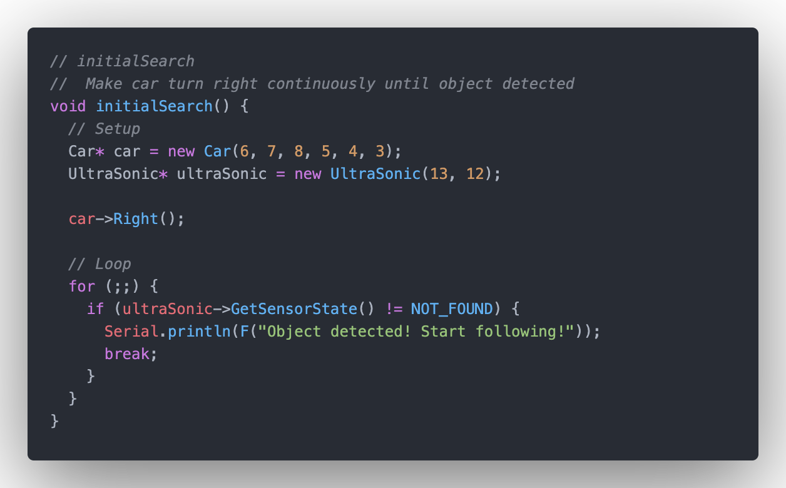

在初始運行時，我希望車子可以旋轉以找尋物體，因此直接讓車子不停向右，並且直到超聲波偵測到物體後直接離開函數。

函數 `initialSearch` 即是用來幫助完成這件事。

### Function setup & loop

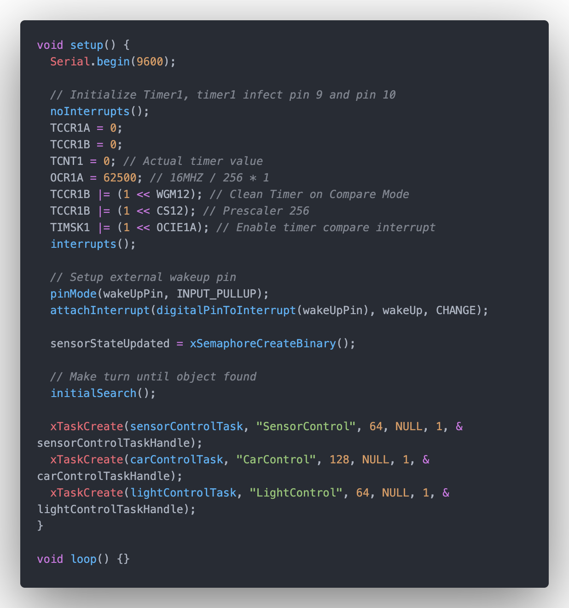

在 `setup` 中，首先設定 Timer1，設定方法在註解已經註明，就不多加贅述。再來設定按鈕是用來觸發 ISR `wakeUp` 函數用，完成後呼叫 `initialSearch` 函數開始找尋物體。最後物體發現後，建立三個 Tasks `sensorControlTask`、`carControlTask` 以及 `lightControlTask`。

# Difficulty

---

1. 在一開始測試馬達運轉時，明明提供了 9V 的電池，但是馬達卻無法克服最一開始的靜摩擦力開始轉動。到最後**將 9V 的碳鋅電池換成 9V 的鹼性電池** 就成功的運轉了**。**
2. 原本設計的休眠模式是將 Arduino 放到 Low Power Mode，再使用 button interrupt 將其喚醒，但是沒想到 Arduino low-power 的 library 不能跟 FreeRTOS 的 library 一起使用，最後只好改了其他方式來呈現休眠模式。